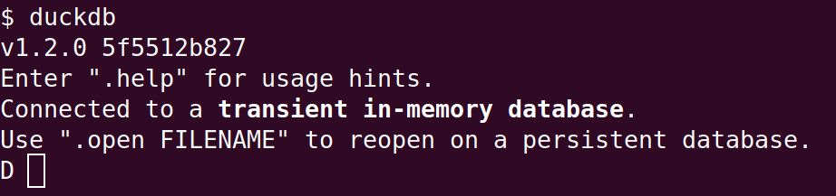
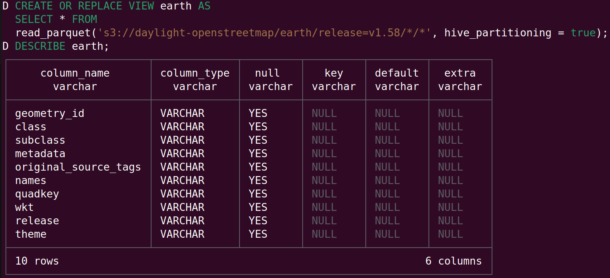

You don't need SaaS data warehouses or query engines like Snowflake or AWS Athena to
access the trove of open data available for free on S3 and S3-compatible cloud stores.
A fast, optimizing, SQL engine is enough to run analytics locally.

Here is how two popular engines - [Apache Impala](https://impala.apache.org/) and 
duckdb(https://duckdb.org/) - can find the largest parks in the worlds in this 
dataset with OpenStreetMap locations - <https://daylightmap.org/earth/> .

## Get started with DuckDB

DuckDB gets you started faster. [Install](<https://duckdb.org/#quickinstall>) it first,
then start the CLI with `duckdb` :



Then read data with [read_parquet](https://duckdb.org/docs/data/parquet/overview#read_parquet-function), associate with a view and explore the results:

```sql
CREATE OR REPLACE VIEW earth AS
SELECT * FROM 
read_parquet('s3://daylight-openstreetmap/earth/release=v1.58/*/*', hive_partitioning = true);

DESCRIBE earth;
```

The `daylight-openstreetmap` S3 bucket is open so there is no need to configure [S3 authentication](https://duckdb.org/docs/extensions/httpfs/s3api.html).

You'll see something like this:




